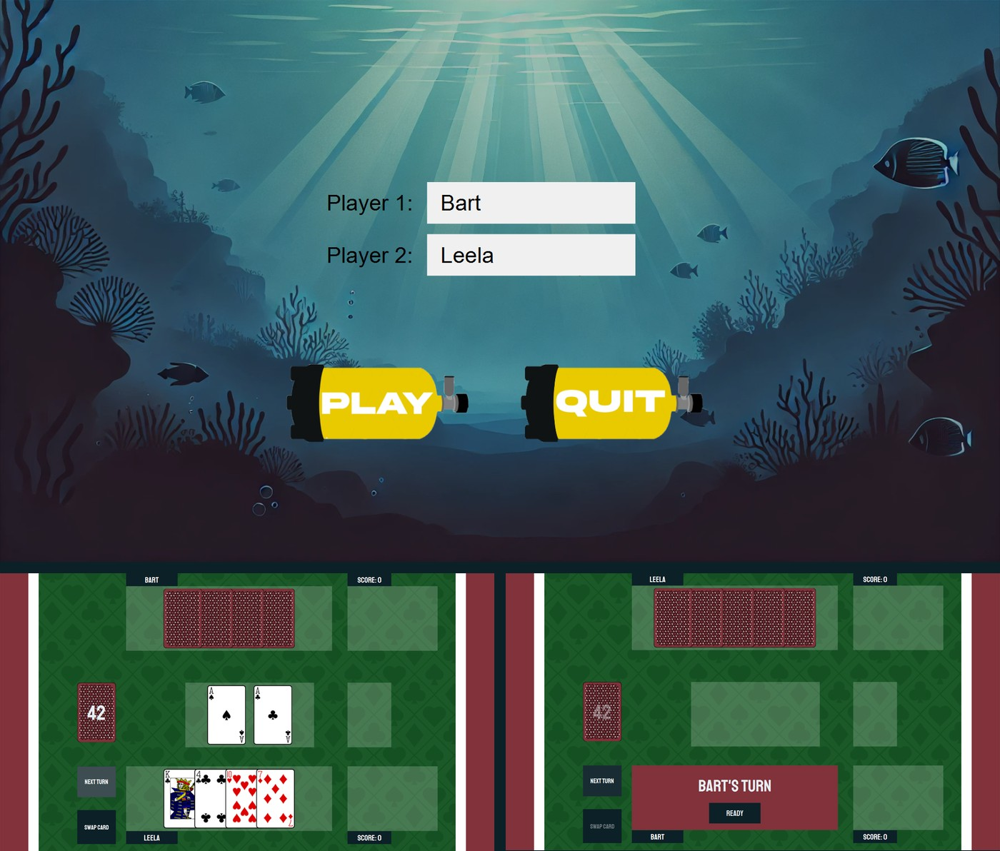

# Tauchen — card game in Kotlin

A two-player card game with a desktop GUI, built in Kotlin with the BoardGameWork framework.
Individual assignment for the Software Praktikum (SoPra) at TU Dortmund, winter term 2024/25.

## Screenshots



## Scope

The rules, the framework and the design — UML, layer split, service signatures — were set by the
course, and the whole cohort built the same game. The implementation of all three layers, the
tests and the whole interface are mine.

## The interface

The GUI is where most of the work went. Cards are played by dragging them onto the middle row, with
the drop target rejecting invalid plays before any action reaches the service layer. Swapping runs
as a separate click-to-select mode, and discarding is a drag onto the discard pile. Because both
players share one screen, a turn-change overlay hides the hand until the next player confirms.
Invalid actions surface an in-game prompt rather than failing silently.

Animations were not required by the assignment. Drawing a card and collecting a trio both animate
the card moving between piles, with the scene locked for the duration and the card view reparented
on completion, so an animation can't be interrupted into an inconsistent state.

The visual theme follows the name — *tauchen* is German for *diving*. The underwater menu, the air
tank buttons, the table background, the palette and the font are all chosen for the project.

## Structure

```
src/main/kotlin/
├── entity/     game state — Card, Player, Tauchen
├── service/    game rules — GameService, PlayerActionService, RootService
└── gui/        views — MainMenuScene, GameScene, ResultMenuScene
```

## Built with

Kotlin (JVM 11), BoardGameWork, Gradle (Kotlin DSL), JUnit 5, Detekt, Kover, Dokka.
29 unit tests on the entity and service layers; public members documented with KDoc.

## Running it

`./gradlew run` (JDK 11 or newer).
